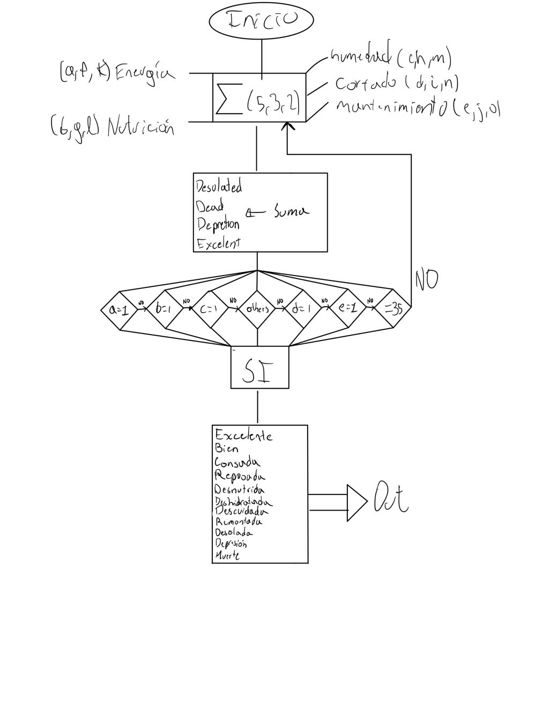

# Proyecto Tamagotchi Electrónica Digital

* Paula Ruiz
* Duvan Tique
* Diego Vitoviz

## 1. Descripción General y Especificaciones de los Sistemas
### 1.1 Introducción 
El proyecto “Tamagotchi” emula una mascota virtual que reacciona a las atenciones del usuario. Se implementa en una FPGA (por ejemplo, Cyclone IV EP4CE6E22C8N) e incluye:
* Botones físicos: Para alimentar, regar, podar, reposar, activar modo prueba, acelerar el tiempo y resetear el juego.
* Sensores:
  * Ultrasónico (movimiento): Detecta cercanía del usuario sin necesidad de pulsar botones.
  * Luz (foto-resistencia con comparador): Indica claridad o noche.
* Pantallas:
  * Matrices LED WS2812 de 8×8 para mostrar la animación del Tamagotchi y sus barras de necesidades.
  * Display de 7 segmentos para visualizar la velocidad y la puntuación.
El Tamagotchi mantiene cinco necesidades: humedad, nutrición, energía, mantenimiento, cortado (podado). Cada necesidad se expresa con 3 bits (valores 0 a 7). Cuando su nivel disminuye, el Tamagotchi cambia de estado (cansado, hambriento, etc.), repercutiendo en la puntuación final.
### Diagrama de Caja Negra


### 1.2. Subsistemas Esenciales
#### Control Principal:
* Coordina el decremento automático de necesidades con el paso del tiempo.
* Maneja la lógica de botones (regar, abonar, podar, reposar, test, reset).
* Actualiza niveles en función de interacción (sensor ultrasónico) y claridad (sensor de luz).
#### Lógica de Estados (Maquina de estados):
* Determina si el Tamagotchi de la planta está “bien”, “Insolada”, “Desnutrida”, “Muerta”, etc., basándose en las necesidades recibidas de controlprincipal.
  Para verificar cada uno de los estados correspondiente para la maquina de estados se realizo el siguiente test bench para probar cada una de los posibilidades
````
module MaquinaEstados_TB;

    // Entradas
    reg clk;
    reg [2:0] humedad;
    reg [2:0] nutricion;
    reg [2:0] energia;
    reg [2:0] mantenimiento;
    reg [2:0] podado;
    reg reposando;
    
    // Salida
    wire [3:0] estado;
    
    // Instanciar el módulo bajo prueba
    MaquinaEstados dut (
        .clk(clk),
        .humedad(humedad),
        .nutricion(nutricion),
        .energia(energia),
        .mantenimiento(mantenimiento),
        .podado(podado),
        .reposando(reposando),
        .estado(estado)
    );
    
    // Generar reloj
    initial begin
        clk = 0;
        forever #5 clk = ~clk;
    end
    
    initial begin
        // Inicializar entradas
        humedad = 7;
        nutricion = 7;
        energia = 7;
        mantenimiento = 7;
        podado = 7;
        reposando = 0;
        
        #10;
        
        // Test 1: Estado DORMIDA (reposando=1)
        reposando = 1;
        #10;
        $display("Test 1: reposando=1 -> Estado = %b (DORMIDA)", estado);
        
        // Test 2: Estado DESOLADA (enfermo >= 3)
        reposando = 0;
        energia = 2;    // <3
        nutricion = 2;  // <3
        humedad = 2;    // <3
        podado = 3;     // >=3
        mantenimiento = 3; // >=3
        #10;
        $display("Test 2: enfermo >=3 -> Estado = %b (DESOLADA)", estado);
        
        // Test 3: Estado MUERTE (marchita >= 2)
        energia = 4;    // <5
        nutricion = 4;  // <5
        humedad = 5;    // >=5
        podado = 5;     // >=5
        mantenimiento = 5; // >=5
        #10;
        $display("Test 3: marchita >=2 -> Estado = %b (MUERTE)", estado);
        
        // Test 4: Estado DESNUTRIDA (nutricion <5)
        nutricion = 4;  // <5
        energia = 5;    // >=5
        humedad = 5;    // >=5
        podado = 5;     // >=5
        mantenimiento = 5; // >=5
        #10;
        $display("Test 4: nutricion <5 -> Estado = %b (DESNUTRIDA)", estado);
        
        // Test 5: Estado DESHIDRATADA (humedad <5)
        nutricion = 5;  // >=5
        humedad = 4;    // <5
        #10;
        $display("Test 5: humedad <5 -> Estado = %b (DESHIDRATADA)", estado);
        
        // Test 6: Estado REMONTADA (podado <5)
        humedad = 5;    // >=5
        podado = 4;     // <5
        #10;
        $display("Test 6: podado <5 -> Estado = %b (REMONTADA)", estado);
        
        // Test 7: Estado DESCUIDADA (mantenimiento <5)
        podado = 5;     // >=5
        mantenimiento = 4; // <5
        #10;
        $display("Test 7: mantenimiento <5 -> Estado = %b (DESCUIDADA)", estado);
        
        // Test 8: Estado INSOLADO (energia <5)
        mantenimiento = 5; // >=5
        energia = 4;    // <5
        #10;
        $display("Test 8: energia <5 -> Estado = %b (INSOLADO)", estado);
        
        // Test 9: Estado EXCELENTE (suma total =35)
        energia = 7;
        nutricion = 7;
        humedad = 7;
        podado = 7;
        mantenimiento = 7;
        #10;
        $display("Test 9: suma=35 -> Estado = %b (EXCELENTE)", estado);
        
        // Test 10: Estado BIEN (condiciones normales)
        energia = 5;
        nutricion = 5;
        humedad = 5;
        podado = 5;
        mantenimiento = 5;
        #10;
        $display("Test 10: condiciones normales -> Estado = %b (BIEN)", estado);
        
        // Finalizar simulación
        #10;
        $finish;
    end
    
endmodule
````

#### Sensores:
* Ultrasónico (ultrasonido.v): Envía trig, mide echo y establece interaccion si la distancia es menor a cierto umbral.
* Modulo sensor fotoresistencia: Genera una señal digital(1 = luz, 0 = oscuridad).
#### Control de Tiempo (timecontrol):
* Genera un pulso (newtime o passsecond) con diferentes velocidades (X1, X2, X5, X10, X50, X100).
* Esto permite acelerar o desacelerar el incremento o decremento de la planta.
#### Pantallas y Animación: 
* Transmisor (Transmisor.v) y ImageControl (ImageControl.v): Codifican los bits de color rgb  (24 bits/píxel) para las matrices LED.
Para cada estado se tiene un color rgb expreado en hexadecimal que se asigna cuando el pixel cargado tiene que estar encendido
````
if(pixelactivo == 1)begin
					case(estado)
							4'b0000:begin
								color <= 24'h7bdf68;
							end
							4'b0001:begin
								color <= 24'h28ff00;
							end
							4'b0010:begin
								color <= 24'hf3ff00;
							end
							4'b0011:begin
								color <= 23'he9ffa3;
							end
							4'b0100:begin
								color <= 24'hbcf408;
							end
							4'b0101:begin
								color <= 24'h00ff00;
							end
							4'b0110:begin
								color <= 24'h25ff00;
							end
							4'b0111:begin
								color <= 24'h987807;
							end
							4'b1000:begin
								color <= 24'hef9cf9;
							end
							4'b1001:begin
								color <= 24'h8488ff;
							end
					endcase
````
* Los multiplexores  (mux64, mux24) y needcomparator: Seleccionan si pintar la imagen base o las barras de necesidades.
* ROManimation: Guarda patrones de 64 bits que se combinan para la animación.
#### Visualización en 7 Segmentos:
* Módulo visualizacion maneja 8 dígitos multiplexados; muestra velocidad en los dos primeros dígitos y la puntuación en los últimos cuatro.
* bcd convierte la puntuación binaria (14 bits) a dígitos BCD.
#### Control de Puntuación (controlpuntuacion):
* Suma puntos cuando el Tamagotchi está en buenas condiciones (≥6 en sus necesidades).
* Descuenta puntos si varias necesidades están ≤2, con penalizaciones adicionales si llegan a 0.
* Aplica bonus (+5) si todas suman 35.
#### Debounce:
* Filtra el ruido de los botones físicos.
* Elimina rebotes en botones (~50 ms).


## 2. Arquitectura del Sistema

### 2.1. Módulo Top (Tamaguchi.v)
Reúne las señales de:

- **Entradas:** clk, botones, echo, claridad.
- **Salidas:** pinout, anodos, display, ledclaridad, ledinteraccion, trig.

Instancia submódulos como Transmisor, ImageControl, StateLogic, controlprincipal, timecontrol, visualizacion, etc. Esta pieza central conecta:

- **Botones** → debounce → controlprincipal
- **Sensores** (echo, claridad) → ultrasonido y directamente a controlprincipal
- **Necesidades y estado** se pasan a StateLogic → se obtiene estado[3:0].
- **Imagen base** desde ROManimation → mux64 → ImageControl, junto con la “banda” de necesidades (needcomparator) → se envían al Transmisor.

### 2.2. Diagrama de Bloques / Caja Negra
El Tamagotchi se representa como un supermódulo con submódulos internos:

- **controlprincipal**: Ajusta humedad, nutrición, energía, etc.
- **StateLogic**: Determina estado final (código 4 bits).
- **controlpuntuacion**: Actualiza el marcador.
- **timecontrol**: Genera pulsos de paso de tiempo.
- **ultrasonido**: Mide distancias.
- **visualizacion**: Multiplexa displays para puntuación y velocidad.
- **Transmisor + ImageControl + needcomparator + ROManimation**: Manejan la lógica de gráficos en `WS2812`.

---
## 3. Funcionamiento e Implementación

### 3.1. Control Principal
- Necesidades: humedad, nutricion, energia, mantenimiento, cortado (3 bits cada una, rango 0–7).
- Disminuyen automáticamente según contadores.
- **Ejemplos:**
  - Energía -1 cada 7 minutos (a `X1`), se acelera en las demás velocidades con los factores de miltiplicación.
  - Nutrición -1 cada 5 minutos.
- **Botones:**
  - botonregar: Sube humedad.
  - botonabonar: Sube nutrición.
  - botonreposar: El Tamagotchi duerme si `energia < 7` y no hay luz ni interacción.
  - botontest: Fuerza estados y necesidades, útil para depurar.
  - botonreset: Restablece todo tras ~5s pulsado.

### 3.2. Lógica de Estado (StateLogic)
Calcula si el Tamagotchi está “cansado”, “desnutrido”, “descuidado”, etc., basado en comparaciones (<5, <3, <2) y otroga un parámetro estado [3:0]:

- **Ejemplo:**
  - `BIEN = 4'b0000` si todas las necesidades ≥5.
  - `MUERTE = 4'b1010` si 4+ necesidades están en 0.

### 3.3. Sensores

#### 3.3.1. Sensor Ultrasónico (ultrasonido)
- FSM con estados SENDTRIG, WAIT, RECIEVEECHO, DELAY.
- **Funcionamiento:**
  - SENDTRIG: Envío de pulso de 10 µs (trig).
  - RECIEVEECHO: Mide cuántos ciclos clk dura echo en alto.
  - Si `countecho <= 25000000`, `interaccion <= 1` (objeto cerca).

#### 3.3.2. Sensor de Luz
- Implementado externamente con un comparador.
- **Salida:** `claridad = 1` si hay luz (`foto-resistencia < 5-10kΩ`), `0` en oscuridad.
- **Integración:** El Tamagotchi no descansa si `claridad == 1`.

### 3.4. Control de Tiempo (`timecontrol`)
- Define velocidad (X1, X2, X5, X10, X50, X100).
- Ajusta cuántos ciclos de clk (50 MHz) se requieren para invertir newtime.
- El usuario cambia la velocidad con botonaceleracción.

### 3.5. Visualización

#### 3.5.1. Matrices LED (`WS2812`)
- **Transmisor**: Genera pulsos específicos para `0` y `1` lógicos.
- **`ImageControl`**: Combina la imagen base (ROManimation) y barras de necesidad (needcomparator).
- **Animaciones**: Alterna frames cada ciertos ciclos direccionados por adress.

#### 3.5.2. Display de 7 segmentos
- `visualizacion` muestra:
  - Velocidad (`01`, `02`, `05`, `10`, `50`, `99` para `X1`...`X100`).
  - Puntuación (`hasta 9999`).
- Conversión binario a BCD (`miles`, `centenas`, `decenas`, `unidades`).

### 3.6. Control de Puntuación
- **Aumento**: +1 si una necesidad sube ≥6.
- **Bonus**: +5 si `humedad + nutricion + energia + mantenimiento + cortado == 35`.
- **Penalización**: -1 punto cada ~1s si alguna necesidad ≤2.
- **Negative bonus**: -5 puntos si 2+ necesidades están en 0.
- **Límite**: `0 ≤ puntuacion ≤ 9999`.

---
## 4. Prototipo y Validaciones

### 4.1. Pruebas en Simulación
- **controlprincipal**: Cambios en necesidades al presionar botones.
- **timecontrol**: Validación de `newtime` en cada velocidad (x1...x100).
- **Transmisor**: Verificación de pulsos de salida.
- **ultrasonido**: Simulación de echo para activar interaccion.

### 4.2. Implementación en FPGA
- **Pines asignados a:**
  - **Entradas:** botones (7 entradas), sensores (echo, trig, claridad).
  - **Salidas:** WS2812 (1 wire data), display 7 segmentos (8 ánodos + 7 bits de segmentos), ledclaridad, ledinteraccion.
[]

### 4.3. Posibles Fallas y Recomendaciones
- **Sensor ultrasónico:** Cableado corto para evitar ruido.
- **Pantallas WS2812:** Ajuste preciso de pulsos.
- **Botones:** Uso correcto de debounce y pull-ups/downs.

---
## 5. Trabajo en Equipo y Gestión del Proyecto
- **Plan de desarrollo:**
  1. Implementación de necesidades.
  2. Sensores y tiempo.
  3. Visualización y puntuación.
  4. Integración final.

---
## 6. Documentación
- **Estructura del repositorio:**
  - `/src`: Archivos `.v`.
  - `/sim`: Testbenches.
  - `/docs`: Diagramas e informe.
- **Legibilidad:**
  - Variables descriptivas.
  - Comentarios en cada archivo.

---
## 7. Conclusiones
- Tamagotchi funcional con múltiples necesidades y estados.
- Sensores (`ultrasonido`, `luz`) para mayor realismo.
- Arquitectura modular eficiente.
- Posibles mejoras: más animaciones, memoria no volátil, modo de “sueño” avanzado.

---
_Proyecto Tamagotchi FPGA - Simulación de una mascota virtual en hardware._


